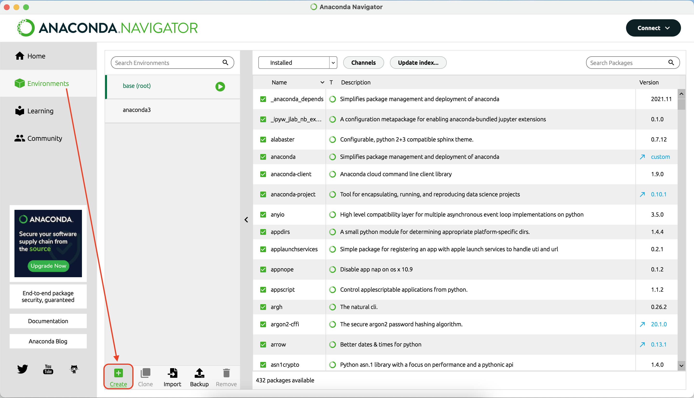
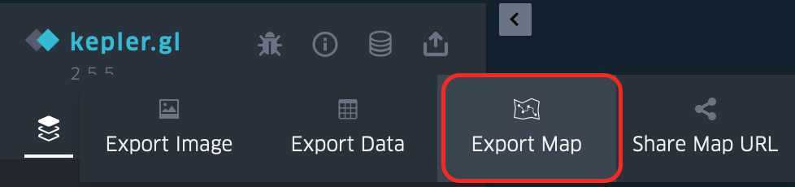
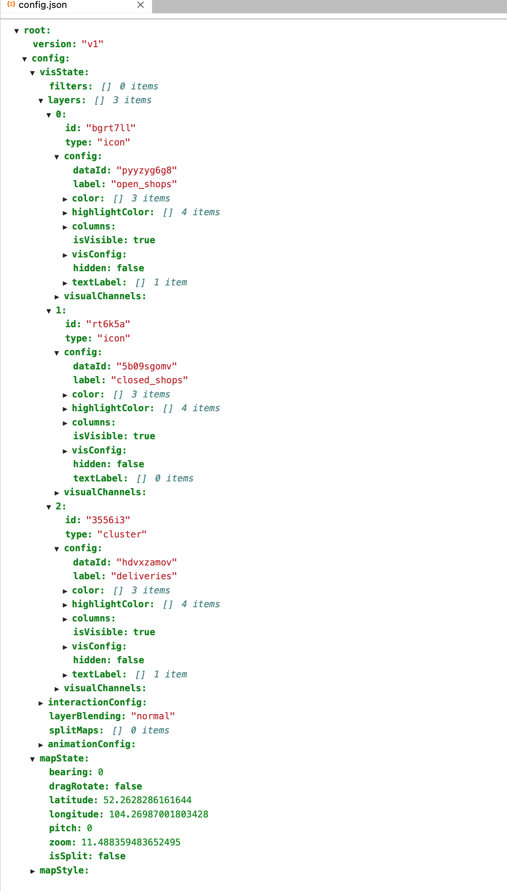
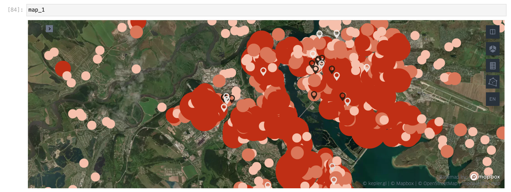

# Исследование данных о трамваях в г. Иркутск

## Проблематика и гипотезы

Изначальная задача была исследовать ул. Тимирязева, а если быть точнее, то участок улицы
от ул. Байкальская до ул. Декабрьских событий. Исследование было проведено и находится
в блокноте `tram_research.ipynb`.

После этого появлялись разные гипотезы по анализу движения трамвая в г. Иркутск
о них подробнее в соответствующих блокнотах.

## Визуализация и трудности при работе с `Kepler.gl`

### Установка `keplergl`

Библиотека `keplergl` довольно капризна, поэтому могут возникнуть проблемы с установкой.

В установке поможет:
- [Официальная документация](https://docs.kepler.gl)
- Данный [топик](https://github.com/NREL/OpenOA/issues/37)

Мои рекомендации:
- Проверить совместить с версией Python. На 23.04.2022 поддержка была 
  Python>=3.7 [Git python kepler.gl](https://github.com/keplergl/kepler.gl/tree/master/bindings/kepler.gl-jupyter)
- Создать отдельный `environment` в **Anaconda.Navigator**

<figure>
    
    <figcaption>Создание нового <code>environments</code> (виртуального окружения) в <b>Anaconda.Navigator</b></figcaption>
</figure>

- Если установка не будет проходить в новый `environment`, то его 
  необходимо удалить, а затем создать новый `environment`. После 
этих шагов установить [GeoPandas](https://github.com/geopandas/geopandas) и 
если всё прошло успешно, то произвести установку `keplergl`

### Автоматизация настройки стиля карты

Для работы с `Kepler.gl` есть несколько вариантов работы:
1) Можно производить выгрузку данных через `Jupyter Notebook`, базу данных или другим способом. Главное, чтобы были широта и долгота для 
   отображения на карте. Затем нужно открыть сайт [`Kepler.gl`](https://kepler.gl) нажать **GET STARTED** и уже при помощи интерфейса 
   добавлять источники данных и кастомизировать карту
2) Можно все выгрузки произвести в `Jupyter Notebook` и добавить всю 
   информацию на карту. После это сохранить, воспользовавшись методом `.save_to_html()`. И всю дальнейшую настройку карту произвести через интерфейс
3) **Наиболее предпочтительный** (но может показаться наименее удобным). 
   Необходимо выгрузить все источники данных, которые необходимо отобразить 
   на карте, затем через интерфейс настроить вид карты: кластера, точки, 
   иконки и прочее; настроить фильтры; настроить подсказки; И выполнить 
   следующие шаги:

- Сверху слева выбрать **Export Map**
<figure>
    
    <figcaption>Экспорт параметров вашей карты</figcaption>
</figure>

- Выбрать `JSON`
<figure>
    
    <figcaption>Экспорт <code>.json</code> параметров вашей карты</figcaption>
</figure>

- Сохранить информацию в файл, в корень, где лежит блокнот. Я сохранил под 
  именем `config.json` 
  (рекомендую вам использовать такое же имя, чтобы в коде не менять 
  наименование переменной)
<figure>
    
    <figcaption>Такого вида данные у вас должны получиться</figcaption>
</figure>

### Использование `config.json` при добавлении данных

Заранее сохранённый `config.json` довольно просто использовать для 
добавления данных на карту и быстрого форматирования.

В `config.json` создаются все те слои, которые ранее были настроены через 
интерфейс.

Для добавления информации о слое необходимо добавить значения поля `dateID` 
из `config.json` в атрибут `name` метода `.add_data()`:
```
# Добавление данных на карту, в name заносится значение из config.json "dataId"

map_1.add_data(data=closed, name='5b09sgomv')
map_1.add_data(data=open, name='pyyzyg6g8')
map_1.add_data(data=tram, name='hdvxzamov')
```

В конце мы выводим карту на экран и получаем:
<figure>
    
    <figcaption>Карта с добавлением данных о слоях из <code>.config.json</code></figcaption>
</figure>
